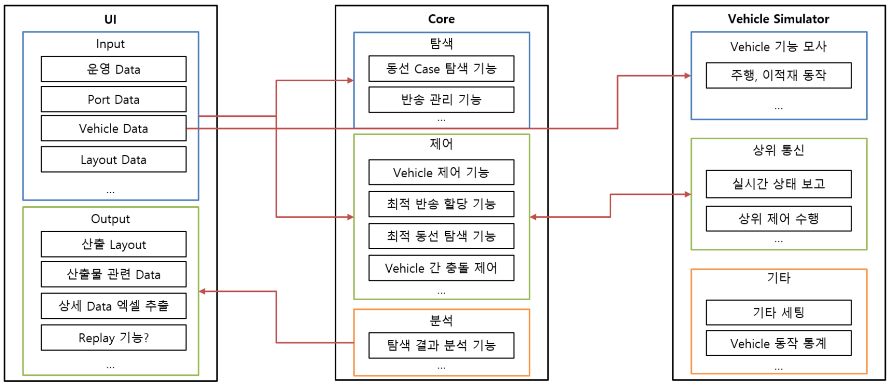

# SDI 프로젝트(가제)

## 프로젝트 소개

`SDI 프로젝트(가제)는 삼성 SDI 물류 자동화를 위해 AGV(자율주행 무인자동차)의 최적동선을 알고리즘으로 찾아내고 ACS(AGV Control System) 시뮬레이션을 통해 시연하는 프로젝트입니다. `

이미지(추후 작성)

삼성청년소프트웨어아카데미 5기 자율프로젝트 기업연계트랙으로 진행된 프로젝트로 삼성SDI와 연계하여 물류 자동화 과정에서 기존에 AGV들의 동선을 수작업으로 작성하여 발생했던 휴먼 에러 및 보틀넥을 줄이고, 효율 최대화를 위하여 AGV들의 동선을 최적화하는 알고리즘을 도출하여 시뮬레이션으로 시연하는 것을 목표로 합니다. 프로그래밍 언어는 Python이며 PyQt를 통해 UI를 보여줍니다.

## 팀원 소개

### 강리정
IoT IoT IoT
### 오승철
경로 탐색 기능 / 복잡한 문제를 풀어내는 알고리즘에 관심
### 이태용
V8엔진은 없지만 차량을 굴러가게 해보자
### 정명지
Vehicle 제어 Core 기능 / 요즘 많이 떠오르는 자동화 로봇은 무엇일까 관심이 생김
### 조동윤
UI / 안드로이드

## 주요 기능

### 데이터 입력
AGV 및 PORT, 충전소의 자유로운 확장
### 최적동선
알고리즘을 이용한 효율적 동선 탐색
### 시뮬레이션
시뮬레이션 분석을 통해 다양한 상황을 사전 검증
### 데이터 분석
결과를 분석하여 최적의 동선과 운영 방식을 제공

## 세부 기능

### 레이아웃 생성
도면 이미지를 불러오기하여 위에 도로, 포트, 충전기(대기장소) 등 아이템들을 그릴 수 있습니다.
도면 이미지에 척도를 위한 가로 길이를 입력하여 실제 환경과 동일한 비율을 생성합니다.
### 포트 및 AGV 데이터 입력
현실 세계의 물류 포트(Port)의 동작 주기를 입력할 수 있습니다.
크기, 속도, 가속도, 회전 방법 등에 따른 AGV의 변수값을 입력할 수 있습니다.
### 최적동선을 위한 알고리즘
A* 등 길찾기 알고리즘을 기반으로 차량의 동선을 선택
Multi-Vehicle Planning을 통해 다수의 차량 동선을 종합적으로 고려
### AGV 제어
교차로 제어, 정체 회피 등 충돌 제어 기능
시뮬레이터에 AGV 제어 명령을 실시간으로 제공
### 시뮬레이션 화면 제공
도면 이미지 기반 시뮬레이션 화면 제공
입력된 AGV 제원 기반 물리적인 운동 구현
### 분석 데이터 출력
최적 AGV 타입과 대수 선정
기준에 따른 최적 데이터를 생성, 파일로 저장하기 지원

## 아키텍처

### 프로젝트 구조도

## How to build
## 릴리즈 히스토리

## 관련문서

[노션(Notion) 페이지](https://spice-session-a8a.notion.site/SDI-bf364b0fe61f457a8687d531096a47e9)

[WBS 스프레드 시트](https://docs.google.com/spreadsheets/d/1HMPFKf2UmTKbTjrtqk0U_vcNYzQtznxR-eZYdHO8HKE/edit?usp=sharing)

[UI 메뉴 계획](https://docs.google.com/spreadsheets/d/1PMcZ8eTfPwLhpXxE9VDXUx82L5bSitthVZU2a6iTxLI/edit?usp=sharing)

[중간발표 자료 초안](https://docs.google.com/presentation/d/1_n9nmc46bJ1XvIrJIzhMT6J674z_0iJPbP7YQtuElyQ/edit?usp=sharing)

[중간발표 자료 미리캔버스](https://www.miricanvas.com/v/1nszrl)

[중간발표 자료](./docs/F102_중간발표(gif제거).pptx)