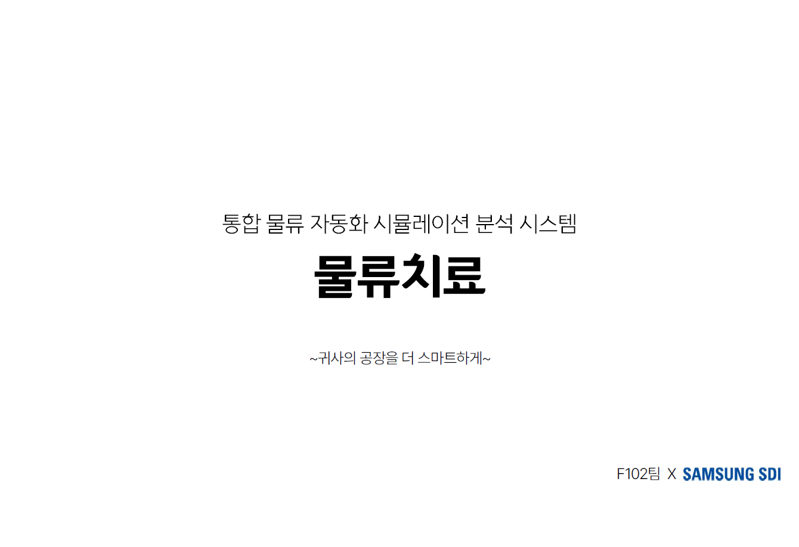
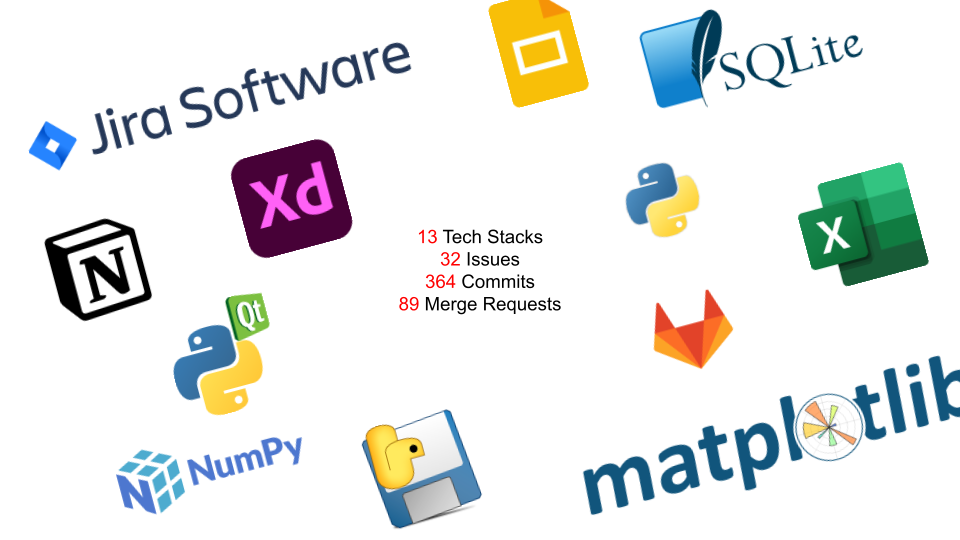
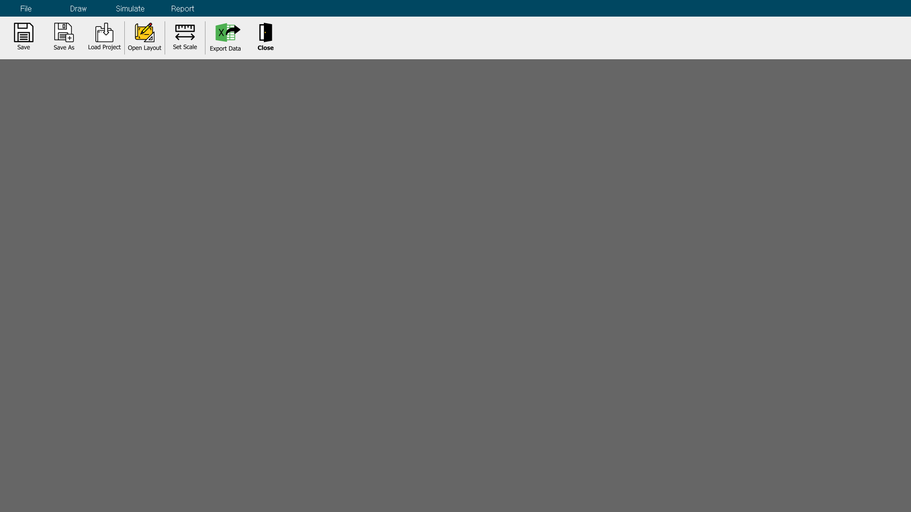
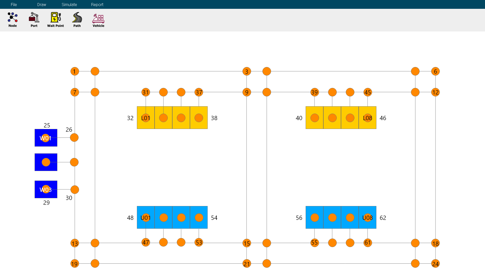
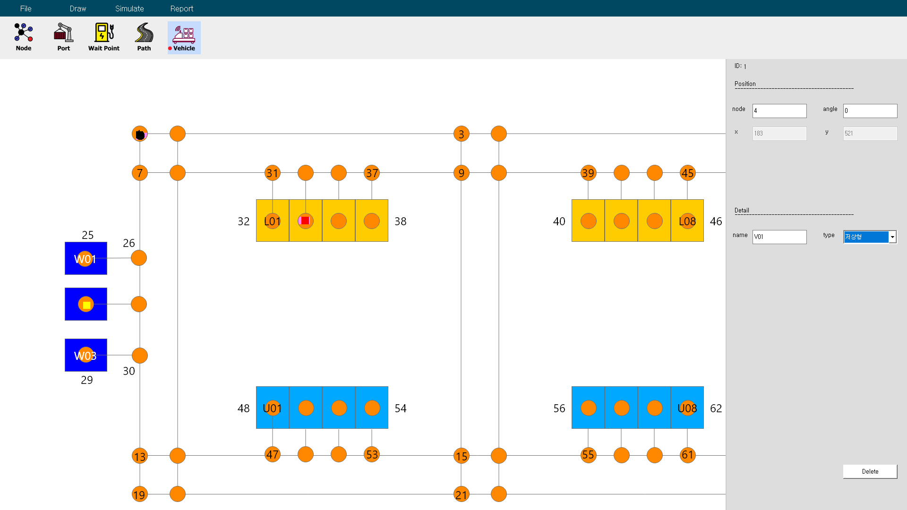
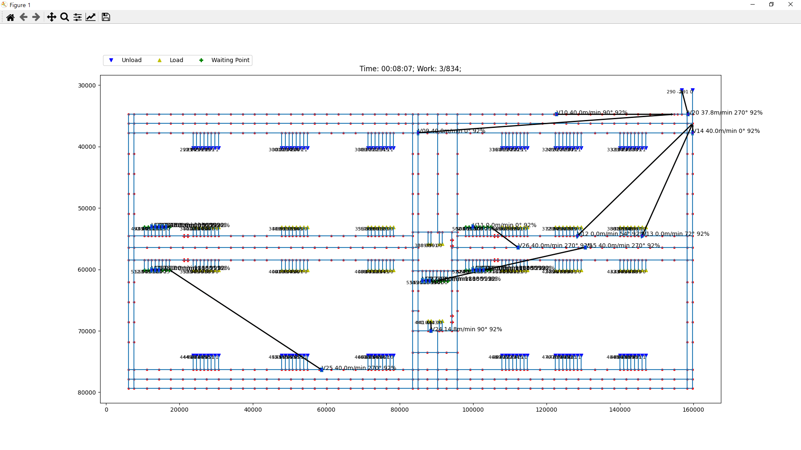
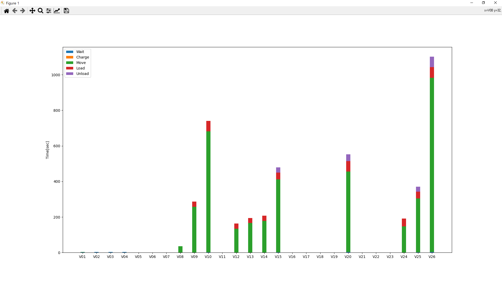
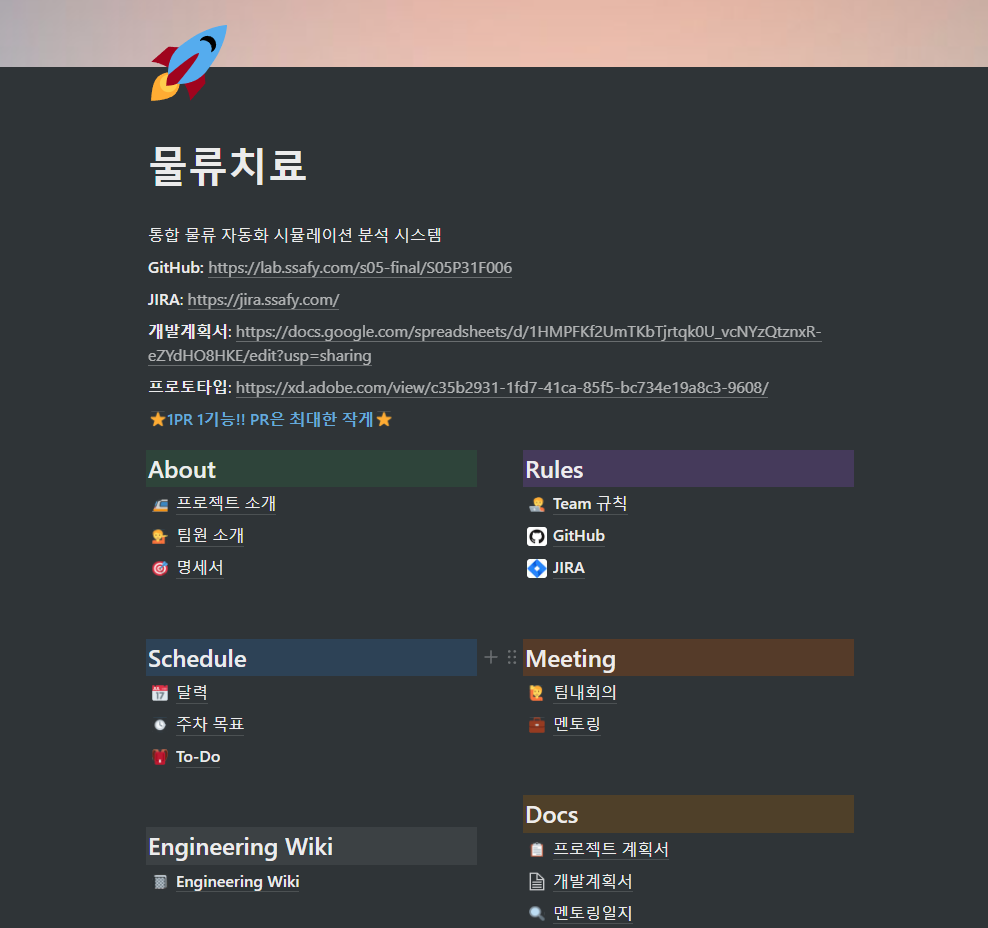
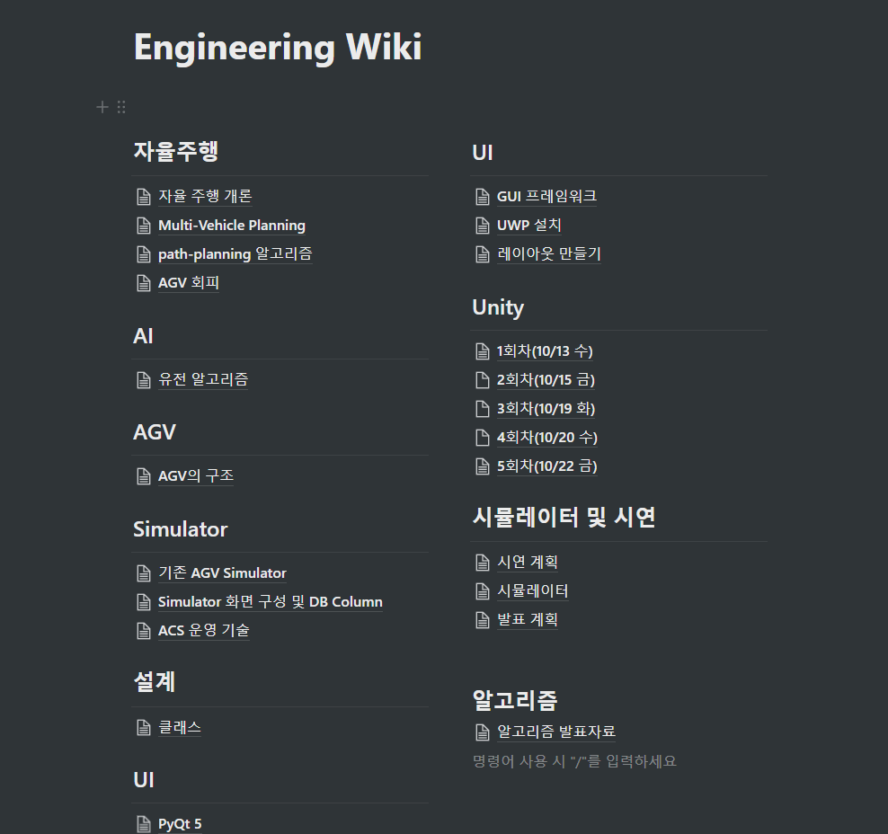
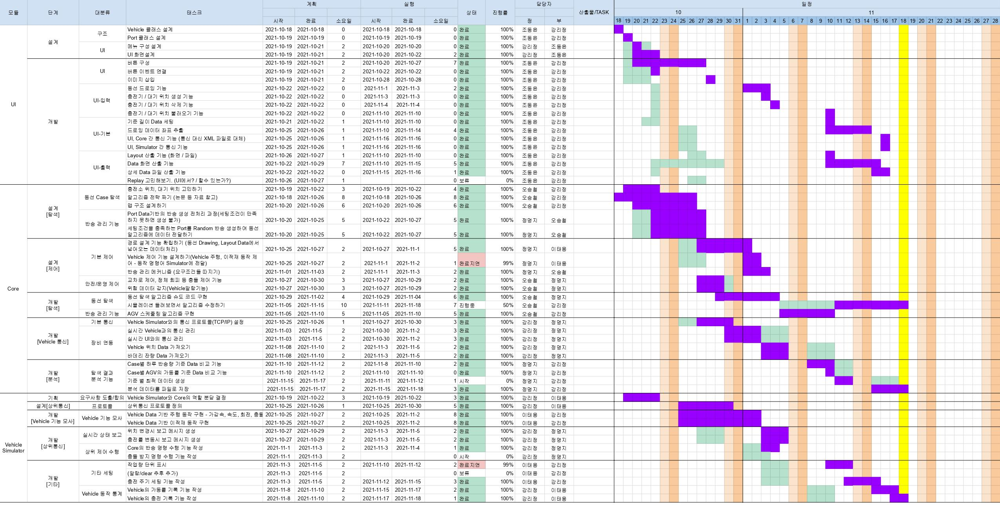

`물류치료는 삼성 SDI 물류 자동화를 위해 AGV(자율주행 무인자동차)의 최적동선을 알고리즘으로 찾아내고 ACS(AGV Control System) 시뮬레이션을 통해 시연하는 프로젝트입니다. `


삼성청년소프트웨어아카데미 5기 자율프로젝트 기업연계트랙으로 진행된 프로젝트로 삼성SDI와 연계하여 물류 자동화 과정에서 기존에 AGV들의 동선을 수작업으로 작성하여 발생했던 휴먼 에러 및 보틀넥을 줄이고, 효율 최대화를 위하여 AGV들의 동선을 최적화하는 알고리즘을 도출하여 시뮬레이션으로 시연하는 것을 목표로 합니다.

## 팀원 소개


### 강리정
IoT IoT IoT
### 오승철
경로 탐색 기능 / 복잡한 문제를 풀어내는 알고리즘에 관심
### 이태용
V8엔진은 없지만 차량을 굴러가게 해보자
### 정명지
Vehicle 제어 Core 기능 / 요즘 많이 떠오르는 자동화 로봇은 무엇일까 관심이 생김
### 조동윤
UI / 안드로이드


## 주요 기능

- 사용자 환경에 맞춤형 설정
- 검증된 알고리즘으로 동선 배정
- 시뮬레이션을 통한 사전 검증
- 시뮬레이션 결과 분석


## 세부 기능

| 구분 | 기능                         | 설명                                                         |
| ---- | ---------------------------- | ------------------------------------------------------------ |
| 1    | **레이아웃 생성**            | 도면 이미지를 불러오기하여 위에 도로, 포트, 충전기(대기장소) 등 아이템과 맵을 자유자재로 그릴 수 있습니다. |
| 2    | **파라미터 상세 설정**       | 현실 세계의 수치들을 입력하여 AGV, Port 등의 변수값을 입력할 수 있습니다. |
| 3    | **최적동선을 위한 알고리즘** | A*, MAPF 등 길찾기 알고리즘 기반의 자체제작 알고리즘으로 다수의 차량을 종합적으로 고려한 동선을 제공합니다. |
| 4    | **물리법칙 적용 시뮬레이션** | 1초 단위 동작까지 AGV의 실제 물리적 움직임을 모사한 시뮬레이션을 제공하고, 2D 모델링으로 보여줍니다. |
| 5    | **분석 데이터 출력**         | 시뮬레이션 데이터를 DB에 저장하고, 효과적인 분석을 위한 통계를 제공하며, Excel 파일로 내보내기를 지원합니다. |

- UI에 대한 자세한 내용은 [여기](UI/README.md)에서 확인할 수 있습니다.
- 사용된 길찾기 알고리즘에 대해서는 [여기](Core/README.md)에서 확인할 수 있습니다.


## 아키텍처

### 프로젝트 구조도


### 기술스택



## 설치 및 실행

소스 코드를 다운로드하여 직접 프로그램을 실행할 수 있습니다. 

직접 코드를 실행하는 경우 3.7 버젼 이상의 [파이썬3](https://www.python.org/downloads/)이 필요하며, 아래 절차에 따라 실행하면 됩니다. 개발환경은 3.9 버젼입니다.

##### 파일 다운로드

```
git clone https://lab.ssafy.com/s05-final/S05P31F006.git
```

그 외, 상단 다운로드 버튼을 클릭하여 zip 파일로 다운로드, 압축해제하면 됩니다.

##### 모듈 설치

프로젝트 폴더로 이동하여 의존성 프로그램을 설치합니다.

```
pip install -r requirements.txt
```

##### 실행

```
python main.py
```

## 사용예시

##### 메인화면



##### 레이아웃 그리기



##### 데이터 입력



##### 시뮬레이션 실행 + 2D 모델링

> 위 사용예시의 레이아웃과는 다른 레이아웃을 사용하여 시뮬레이팅했습니다.



##### 데이터 출력




## 개발설정

- Python 3.9.7
- 가상환경을 지원하지 않습니다.
- 경로명에 한글이 들어간 경우 정상적으로 작동하지 않을 수 있습니다.
- 하드웨어 사양에 따라 디스플레이 내용이 달라질 수 있습니다.


## 릴리즈 히스토리

- 0.0.1

## 추가정보

프로젝트 기간: 2021-10-11 ~ 2021-11-19 (6주)

## 기여

1. 해당 프로젝트를 Fork 하세요 (https://lab.ssafy.com/s05-final/S05P31F006/-/forks/new)
2. feature 브랜치를 생성하세요 (`git checkout -b feature/fooBar`)
3. 변경사항을 commit 하세요 (`git commit -m 'feat: Add some fooBar'`)
4. 브랜치에 Push 하세요 (`git push origin feature/fooBar`)
5. 새로운 Merge Request를 요청하세요

## 라이선스


## 관련문서

[노션(Notion) 페이지](https://spice-session-a8a.notion.site/SDI-bf364b0fe61f457a8687d531096a47e9)





[WBS 스프레드 시트](https://docs.google.com/spreadsheets/d/1HMPFKf2UmTKbTjrtqk0U_vcNYzQtznxR-eZYdHO8HKE/edit?usp=sharing)



[UI 메뉴 계획](https://docs.google.com/spreadsheets/d/1PMcZ8eTfPwLhpXxE9VDXUx82L5bSitthVZU2a6iTxLI/edit?usp=sharing)

[프로토 타입](https://xd.adobe.com/view/c35b2931-1fd7-41ca-85f5-bc734e19a8c3-9608/)

[중간발표 자료 초안](https://docs.google.com/presentation/d/1_n9nmc46bJ1XvIrJIzhMT6J674z_0iJPbP7YQtuElyQ/edit?usp=sharing)

[중간발표 자료 미리캔버스](https://www.miricanvas.com/v/1nszrl)

[중간발표 자료](./docs/F102_중간발표(gif제거).pptx)

개발 요청서(비공개)
